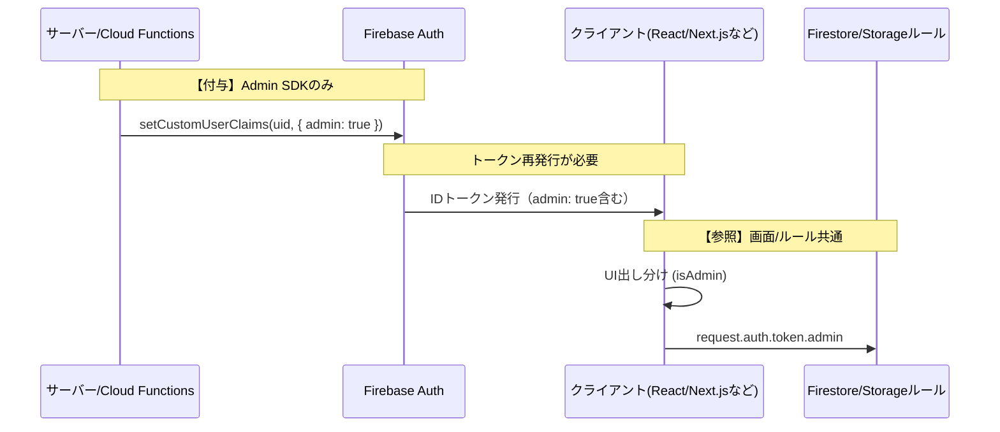

# 【Firebase】初心者でも分かるCustom Claims入門：サーバーで付与してクライアントで活用する権限管理

## はじめに

Firebaseでアプリを運営していると「管理画面は特定の人だけ」「有料会員だけ機能解放したい」といった要件が必ず出てきます。そんなときに役立つのが **Custom Claims**。本記事では「どこで付与して、どこで参照するのか？」という最初のハードルを、実装手順とコード例で丁寧に解説します。

## Custom Claimsとは？

Custom Claimsは、Firebase AuthenticationのIDトークンに任意のプロパティを付与できる仕組みです。`uid` や `email` だけでは表現できない役割・プラン情報などを `admin: true` や `plan: "premium"` のように自由に追加できます。

## 鉄の掟：サーバーで付与、クライアント/サーバーで参照

セキュリティ事故を防ぐ上で最重要なのは、**Custom Claimsは特権環境（Admin SDK）でしか書き込めない**という事実です。クライアントは読み取りのみ。

:::message alert
クライアント（ブラウザ/アプリ）からCustom Claimsを書き換えることはできません。
:::

### データフロー（Mermaid図）



---

## 1. 【付与】サーバー側で権限をセットする

Admin SDKを使い、Cloud Functionsや自前のバックエンド（Node.jsなど）で実行します。以下は特定ユーザーを管理者に格上げする例です。

```javascript
const admin = require('firebase-admin');
admin.initializeApp();

async function setAdminRole(uid) {
  try {
    await admin.auth().setCustomUserClaims(uid, {
      admin: true,
      accessLevel: 9,
    });
    console.log(`ユーザー ${uid} に管理者権限を付与しました`);
  } catch (error) {
    console.error('Custom Claims設定でエラー:', error);
  }
}
```

- **書き込みは常にサーバー側で**：Cloud FunctionsのHTTPS Callable Functionにして、管理者だけが実行できるようにすると安全です。
- **複数権限の管理**：`accessLevel` や `plan` などを組み合わせると、将来的なロール拡張も容易になります。

## 2. 【参照】クライアントでUIを出し分ける

クライアントでは `getIdTokenResult()` を用いて最新のトークンを解析し、Custom Claimsの有無でUIを制御します。

```typescript
import { getAuth } from 'firebase/auth';

const auth = getAuth();

export const checkUserRole = async () => {
  const user = auth.currentUser;
  if (!user) return;

  const idTokenResult = await user.getIdTokenResult();
  if (idTokenResult.claims.admin) {
    console.log('あなたは管理者です');
    // 管理者向けのUI/ルーティング
  } else {
    console.log('一般ユーザーです');
  }
};
```

- **SSR/Next.js** でも `getIdToken` を使って同様に判定できます。
- **状態管理**：RecoilやZustandに `isAdmin` フラグを保存してコンポーネント全体で参照すると便利です。

## 3. 【参照】セキュリティルールで最終防衛線を張る

フロントのみの判定では直接APIを叩かれると突破されます。Firestore/StorageルールでもCustom Claimsを参照してアクセスコントロールしましょう。

```javascript
rules_version = '2';
service cloud.firestore {
  match /databases/{database}/documents {
    match /products/{productId} {
      allow read: if true;          // 誰でも可
      allow write: if request.auth.token.admin == true;
    }
  }
}
```

- **request.auth.token** にCustom Claimsが含まれるため、ルール内で細かいロジックを記述できます。
- **Storage/RTDB** でも同様です。

## 初心者がハマる罠：トークン更新

「サーバーで付与したのにクライアントで反映されない！」という場合、古いIDトークンを使い続けているのが原因です。IDトークンは最大1時間キャッシュされるため、権限変更後は強制リフレッシュが必要です。

```typescript
const user = auth.currentUser;
if (user) {
  await user.getIdToken(true); // 強制リフレッシュ
  const latestClaims = await user.getIdTokenResult();
  console.log(latestClaims.claims.admin); // -> true
}
```

- **管理画面でのロール変更直後** にこの処理を走らせると、ユーザーはすぐに新しい権限で操作できます。
- **バックエンド連携** では、IDトークンを検証したサーバー側で `decodedToken.admin` を確認し、レスポンスを切り替えます。

## ベストプラクティスまとめ

1. **Custom ClaimsはAdmin SDKだけで書き込む**（権限操作をHTTPエンドポイントでラップする場合も認証必須に）。
2. **クライアント/UI・バックエンド・セキュリティルールで一貫して参照**し、表示と実際のアクセス制御を両輪で守る。
3. **トークン強制更新を導線化**（管理画面で権限変更時にリロード/再ログインを促すなど）。
4. **ログ/監査を残す**：誰がいつ権限を付与したのかをFirestoreなどに記録しておくとトラブルシュートが容易。

## 参考リンク

- [Firebase公式: Custom Claims (英語)](https://firebase.google.com/docs/auth/admin/custom-claims)
- [Firebase公式: Custom Claims (日本語)](https://firebase.google.com/docs/auth/admin/custom-claims?hl=ja)
- [Stack Overflow: setCustomUserClaimsのベストプラクティス](https://stackoverflow.com/questions/57429120/firebase-admin-sdk-set-merge-custom-user-claims)
- [関連ブログ/動画](https://blog.shinonome.io/firebase-auth-custom-claims/)

## まとめ

- **Custom Claims = デジタル身分証の追記事項**。
- **付与（Write）はサーバーのみ、参照（Read）はクライアント/サーバー共通**。
- **権限変更後はIDトークンの強制リフレッシュ**を忘れずに。

この流れさえ押さえておけば、Firebaseでのロール/プラン管理はぐっと簡単になります。ぜひ自分のアプリにも取り入れてみてください！
