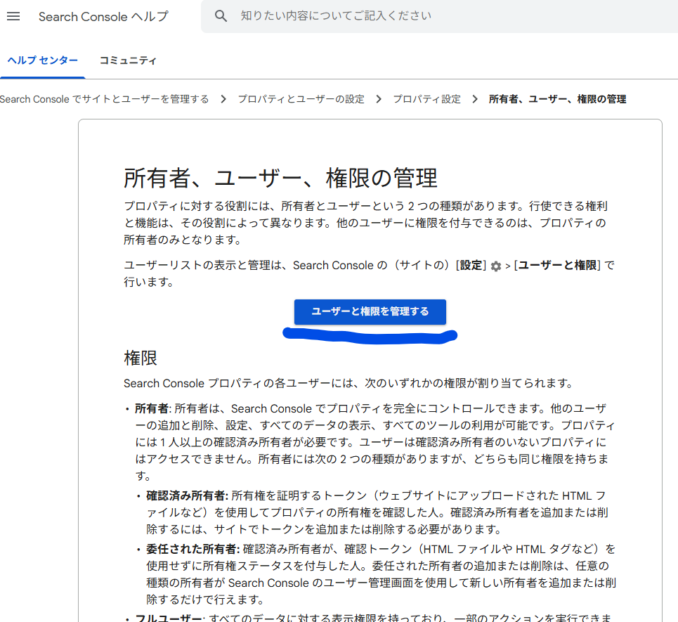
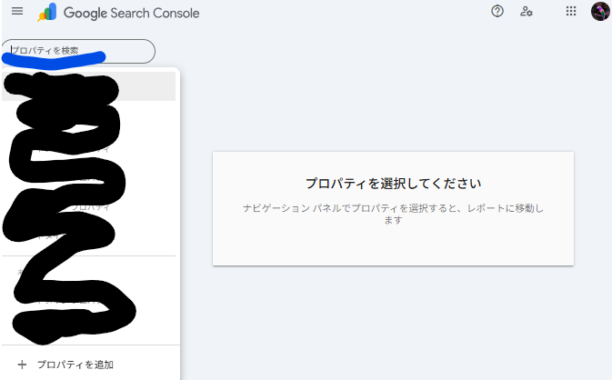
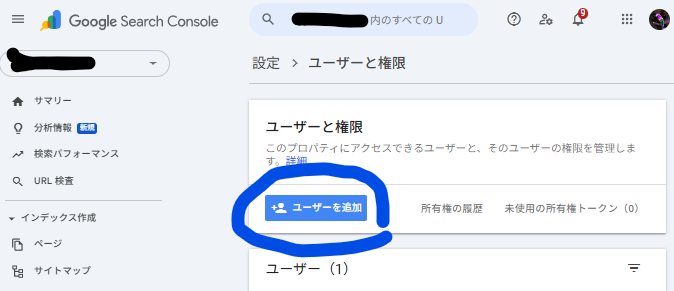
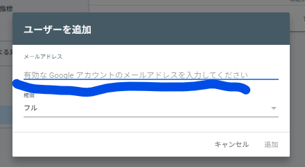

# Google サーチコンソールでユーザー権限を付与する方法

Google サーチコンソールで他のユーザーに権限を付与する手順を解説します。チームメンバーや外部の協力者にアクセス権を与える際に参考にしてください。

## Step 1: ユーザーと権限を管理するページにアクセス

まず、[Google サーチコンソールのヘルプページ](https://support.google.com/webmasters/answer/7687615?hl=ja)にアクセスし、「ユーザーと権限を管理する」をクリックします。

## Step 2: プロパティを選択する

権限を付与したいプロパティ（ウェブサイト）を選択します。

## Step 3: ユーザーを追加をクリック

「ユーザーを追加」ボタンをクリックして、新しいユーザーの追加画面を開きます。

## Step 4: 招待する人のメールアドレスを入力

招待したいユーザーのメールアドレスを入力し、適切な権限レベル（オーナー、フルユーザー、制限付きユーザー）を選択して招待を送信します。

## まとめ

以上の 4 ステップで、Google サーチコンソールに新しいユーザーを追加できます。権限レベルは後から変更することも可能なので、まずは必要最小限の権限から始めることをおすすめします。
