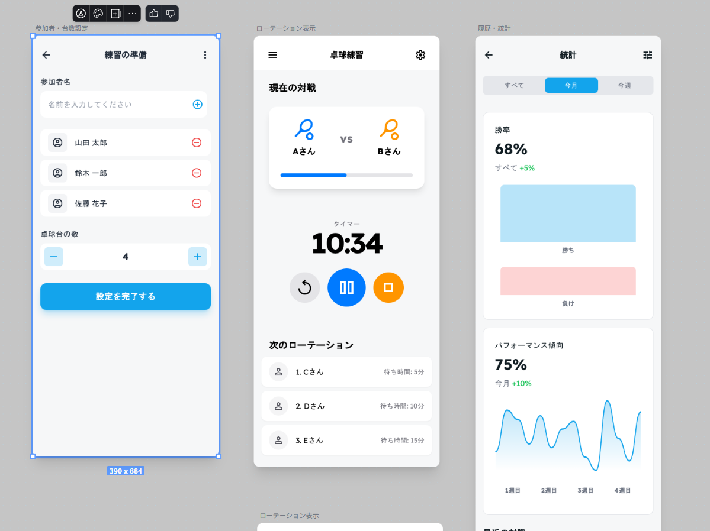
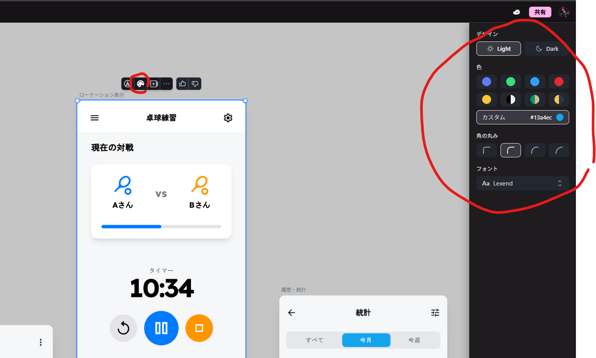
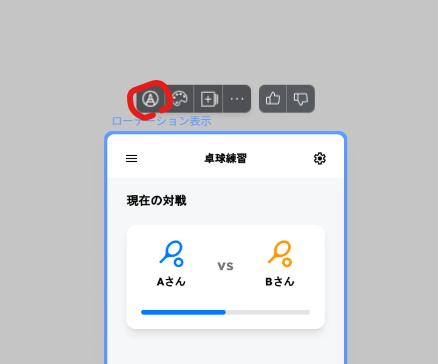
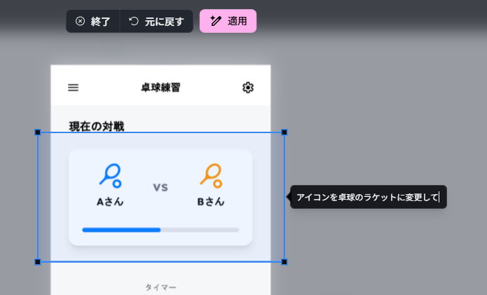
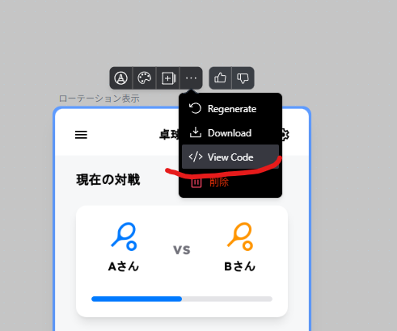

# Stitch 徹底解説：プロンプトから UI とコードまで

## はじめに

Google の「Stitch」は、テキストや画像から Web/モバイルの UI とフロントエンドコードを数分で生成する AI デザインツールです。アイデア出しから実装初動までを一気通貫で短縮できるのが特徴で、最新アップデートで提案品質やワークフロー連携が大幅に改善されて、実務でも使いやすくなってきました。
このレベルを一発のプロンプト AI が作れるようになったのすごくないですか？


## Stitch とは

- Google Labs の実験的プロジェクトで、自然言語や画像を入力すると、複数レイアウトの UI 案と HTML/CSS 等のコードを生成してくれます。
- モデルは Gemini 2.5 系を活用していて、Pro と Flash の選択で精度と速度のトレードオフを切り替えられます。
- 目的は「UI のアイデア出しを高速・容易にする」ことで、設計と開発の断絶を埋めることにフォーカスしています。

## 何が新しくなったか

- 見た目の「人間味」が増して、初回生成でそのまま採用できるケースが増えてきました。
- パターン生成で「ポップ/カラフル」など複数のスタイル案を横並び比較して、即採用・適用できるようになっています。
- 公開共有リンクとアノテーションで、レビュー収集と具体的な修正指示がオンラインで完結するのも便利です。

## 基本の使い方（最短ルート）

1. 種別（アプリ/Web）とモード（標準/実験）を選択して、日本語で画面要件を入力するか、ラフスケッチや既存 UI のスクショをアップロードします。
2. 複数ページの提案を受け取って、候補から採用しつつテーマやプライマリーカラーを当てて世界観を固めていきます。
   テーマはここから変えれます。
   
3. 共有リンクで関係者レビューを回して、アノテーションで箇所指定のフィードバックを反映して質を上げます。
   
   
4. View Code や一括ダウンロードでコードを取得して、実装側に引き渡してプロトタイプを起動します。
   

## 動画で示された実用ポイント

- 「LLM 比較ダッシュボード」「金融系アプリ」などを一発生成できて、人手との差が分からない水準の UI 案が出てきます。
- 画像ベースの指示でプロフィール画面などの追加生成も可能で、画面増殖の速度が実務上の武器になりそうです。
- 実験版モードでは Figma 連携が使えないケースもあるので、コード出力で IDE やエージェント実装に直送する流れが現実的かなと。

## 開発ワークフローへの組み込み

- 0→1 の UI 構図出しは Stitch で複数案を可視化して、採用案のみコード出力して実装に渡すと手戻りが激減します。
- LP/EC の A/B テストは、ヒーロー・CTA・カード配置のパターン生成 → 共有リンクでの即時レビュー → 軽量反復が効率的です。
- 既存プロセスに合わせて、Figma 貼り付け対応環境ならビジュアル検討、コード出力なら実装検証をそれぞれ高速化できます。

## プロンプト設計のコツ

- 目的・KPI・ユーザー像・主要タスク・必須コンポーネント・トーン＆ブランディング（色/フォント）を最初の一段で与えると初期精度が安定します。
- レイアウト制約（グリッド/ブレークポイント/余白）、アクセシビリティ（コントラスト比/フォーカス可視化）、コンポーネント命名規則を明示するとコード品質も上がります。
- 画像併用では、手描きワイヤー＋注記を添えて、各要素の優先度や非機能要件も短文で補足するといい感じです。

```text
例プロンプト：
目的：SaaSの無料トライアル獲得（CVR改善）
対象：中小の開発チームマネージャ
必須：ヒーロー（価値提案＋CTA2種）、機能3カラム、導入実績、価格表、FAQ、フッター
スタイル：モダン/クリーン、プライマリー #2563EB、フォントは可読性重視
レイアウト：12カラム、最大幅1200px、セクション余白64px、SPは1カラム
アクセシビリティ：コントラストAA、フォーカスリング可視、リンクは下線
コード：セマンティックHTML＋BEM、CSS変数で色/余白、Light/Dark両対応
```

上記は初回精度とコード整備性を両立しやすい最小構成例です。

## 品質を上げる反復手順（短サイクル）

- 生成 →3 案比較 →1 案採用 → テーマ/カラー適用 → アノテ指示 → 微修正 → コード出力 → ブラウザ検証、の 8 ステップを 10〜15 分で回せます。
- 重要セクションは「対比」「余白」「視線誘導（Z/F パターン）」を都度チェックして、必要ならパターン再生成で差し替えます。
- CTA 文言や配置は A/B 前提で 2 変種を持って、共有リンクで非デザイナーからも素早くフィードバックを得られます。

## 実装ブリッジ（コード出力の使いどころ）

- View Code の HTML/CSS はそのままコンポーネント分割して、開発用リポジトリに移植すると初期レイアウトが即時に立ち上がります。
- コードエージェントや IDE 補完と組み合わせて、アクセシビリティ改善やデザインシステム適合を自動変換のタスクとして連鎖させられます。
- Figma ベースで詰めたい場合は貼り付け対応環境を利用して、デザイン検討後に再度コード出力という往復も可能です。

## 注意点と限界

- 実験版モードでは Figma 連携が使えないことがあって、ロゴなど一部の画像置換指示が通りにくいケースもあるようです。
- 無料でも使い勝手は良好ですが、月間生成回数など利用上限があるので、チーム運用する場合は配分設計が必要かもしれません。

## まとめ

Stitch は「設計の初速」を圧倒的に高める実用的な AI ツールといった感じです。パターン生成・共有・アノテーション・コード出力まで揃ったことで実案件の初動に十分耐える水準に到達していると個人的に思います。一方で Figma 連携や画像差し替えの挙動など実験的な側面は残るため、0→1 の叩き台とレビュー加速に割り切って使うのが最適解かなと。

## 参考リンク

- [Stitch 公式サイト](https://stitch.withgoogle.com)
- [Google Developers Blog - Stitch: A new way to design UIs](https://developers.googleblog.com/ja/stitch-a-new-way-to-design-uis/)
- [技術評論社 - Stitch の公開共有機能](https://gihyo.jp/article/2025/10/stitch-public-sharing)
- [Zenn - Stitch プロンプト設計](https://zenn.dev/kimkiyong/articles/c374722c03f84e)
- [Zenn - Stitch 活用事例](https://zenn.dev/barabara/articles/2a486280615be5)
