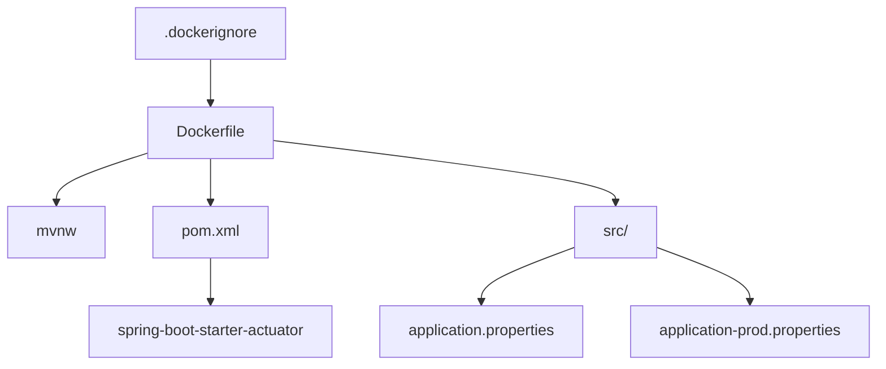

# 【無料】Spring Boot TODO アプリを Render.com にデプロイする完全ガイド

このガイドでは、前回の記事で作成した Spring Boot TODO アプリケーションを Render.com にデプロイする手順を説明します。

:::message
**📚 前提記事**: [Spring Boot + LocalStorage で作る TODO アプリ完全ガイド](https://zenn.dev/your-username/articles/spring_boot_todo)  
まだ TODO アプリを作成していない方は、上記の記事を参考にアプリケーションを作成してください。
:::

## 前提条件

- 前回の記事で作成した Spring Boot TODO アプリ
- GitHub アカウント
- Render.com アカウント（無料プランで OK）
- プロジェクトが GitHub リポジトリにプッシュされている

## 必要なファイル

:::message

**🚀 今回のデプロイ用コード**: [feature/render-deployment ブランチ](https://github.com/Inosuke0718/todo_demo/tree/feature/render-deployment) に今回のデプロイに必要なファイル（Dockerfile、設定ファイルなど）がすべて含まれています。
:::

デプロイに必要なファイルが揃っていることを確認してください。

以下、各ファイルの詳細を説明します：

### ファイル構成

```
プロジェクトルート/
├── Dockerfile                                    # コンテナビルド設定
├── .dockerignore                                # Docker用除外ファイル
├── pom.xml                                      # Maven設定（Actuator含む）
├── src/main/resources/
│   ├── application.properties                   # 基本設定ファイル
│   └── application-prod.properties              # 本番環境専用設定
└── mvnw                                         # Maven Wrapper実行ファイル
```

### 各ファイルの詳細

#### 1. Dockerfile

**パス**: `プロジェクトルート/Dockerfile`
**役割**:

- Docker コンテナのビルド手順を定義
- Multi-stage build でビルドと実行環境を分離
- セキュリティ向上のため非 root ユーザーで実行

**重要なポイント**:

- `eclipse-temurin:17-jre-alpine`を使用（軽量で安全）
- Maven 依存関係のキャッシュ最適化
- ポート設定は環境変数`PORT`に対応

#### 2. .dockerignore

**パス**: `プロジェクトルート/.dockerignore`
**役割**:

- Docker ビルド時に不要なファイルを除外
- ビルド速度の向上とセキュリティ強化
- イメージサイズの削減

**除外対象**:

- `target/` - Maven ビルド成果物
- `.git/` - Git 履歴（数 MB〜GB）
- `*.md` - ドキュメントファイル
- `.vscode/` - エディタ設定

#### 3. pom.xml

**パス**: `プロジェクトルート/pom.xml`
**役割**:

- Maven 依存関係とビルド設定
- Spring Boot Actuator を含む必要な依存関係を定義

**重要な依存関係**:

```xml
<dependency>
    <groupId>org.springframework.boot</groupId>
    <artifactId>spring-boot-starter-actuator</artifactId>
</dependency>
```

#### 4. application.properties

**パス**: `src/main/resources/application.properties`
**役割**:

- 全環境共通の基本設定
- ポート設定、プロファイル設定、基本ログ設定

**主な設定**:

- `server.port=${PORT:8080}` - Render のポート自動割り当てに対応
- `spring.profiles.active=${SPRING_PROFILES_ACTIVE:prod}` - 環境別設定の切り替え

#### 5. application-prod.properties

**パス**: `src/main/resources/application-prod.properties`
**役割**:

- 本番環境専用の最適化設定
- パフォーマンス向上とセキュリティ強化

**主な最適化設定**:

- `spring.thymeleaf.cache=true` - テンプレートキャッシュ有効化
- `server.compression.enabled=true` - HTTP 圧縮有効化
- `server.servlet.session.cookie.secure=true` - セキュアクッキー設定
- `spring.jpa.show-sql=false` - SQL ログ出力無効化

#### 6. mvnw（Maven Wrapper）

**パス**: `プロジェクトルート/mvnw`
**役割**:

- Maven の実行ファイル（Unix/Linux 用）
- Docker ビルド時に Maven コマンドを実行

**注意点**:

- 実行権限が必要（`chmod +x ./mvnw`）
- `.mvn/`ディレクトリも必要

### ファイルの依存関係



## デプロイ手順

### 1. GitHub にプッシュ

最新のコードを GitHub にプッシュします：

```bash
git add .
git commit -m "Ready for Render deployment"
git push origin [ブランチ名]
```

### 2. Render.com でサービス作成

1. [Render.com](https://render.com)にログイン
2. ダッシュボードで「New +」をクリック
   
3. 「Web Service」を選択
   
4. 「Build and deploy from a Git repository」を選択
5. GitHub アカウントを接続（初回のみ）
6. 対象のリポジトリを選択
   

### 3. サービス設定

以下の設定を行います：

#### 基本設定

- **Name**: `todo-demo`（または任意の名前）
- **Language**: `Docker`
- **Branch**: デプロイしたいブランチを選択
- **Region**: `Oregon (US West)`（または任意のリージョン）
- **Root Directory**: 空欄のまま
- **Dockerfile Path**: `Dockerfile`
- **Instance Type**: `Free`

### 4. 環境変数の設定

「Environment」セクションで以下の環境変数を追加：

| 変数名                   | 値                  | 説明                               |
| ------------------------ | ------------------- | ---------------------------------- |
| `SPRING_PROFILES_ACTIVE` | `prod`              | プロダクションプロファイルを有効化 |
| `JAVA_OPTS`              | `-Xmx512m -Xms256m` | JVM メモリ設定                     |

### 5. ヘルスチェック設定

「Health Check Path」に以下を設定：

```
/actuator/health
```


### 6. デプロイ実行

1. 「Create Web Service」をクリック
2. 初回ビルドが開始されます（5-10 分程度）
3. ビルド完了後、アプリケーションが自動起動

## デプロイ後の確認

### アクセス確認

デプロイ完了後、以下の URL でアプリケーションにアクセスできます：

```
https://[サービス名].onrender.com
```

### ちょっと長いけど、設定時の画像はこんな感じ


### 動作確認

デプロイされたアプリケーションで以下の機能が正常に動作することを確認してください：

1. **TODO の追加**: 新しいタスクを追加できる
2. **TODO の編集**: 既存のタスクを編集できる
3. **TODO の削除**: 不要なタスクを削除できる
4. **完了状態の切り替え**: チェックボックスで完了/未完了を切り替えられる
5. **データの永続化**: ページをリロードしても LocalStorage のデータが保持される

これで、前回作成した TODO アプリが無料でインターネット上に公開されました！🎉

## まとめ

この記事では、Spring Boot TODO アプリを Render.com にデプロイする方法を解説しました。

### 今回学んだこと

- Docker を使用したコンテナ化
- Render.com での無料デプロイ
- 本番環境用の設定ファイル作成
- ヘルスチェック機能の実装

### 次のステップ

- カスタムドメインの設定
- データベース（PostgreSQL）の追加
- CI/CD パイプラインの構築
- パフォーマンス監視の導入

## 関連記事

https://zenn.dev/your-username/articles/spring-boot-todo
